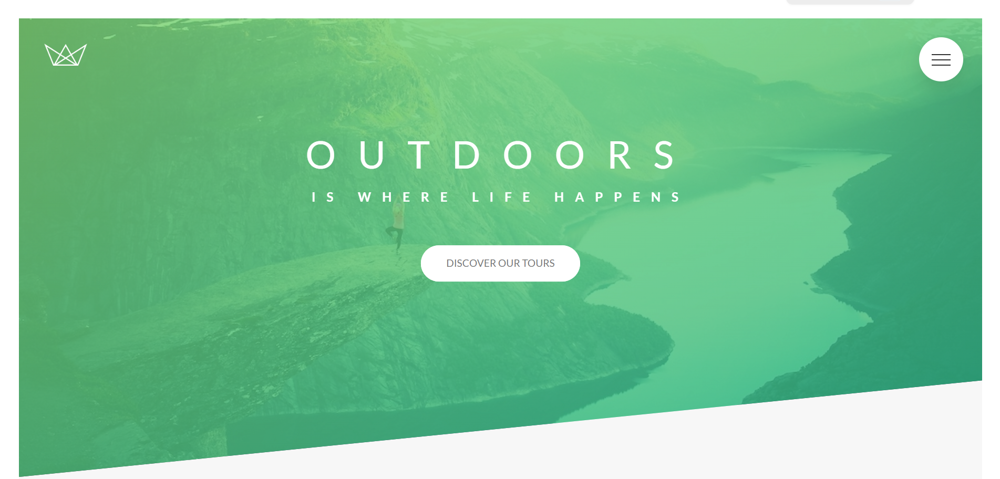

# Simple HTML & SASS Project

This is a simple front-end project built with HTML, CSS, and Sass, configured with Live Server for automatic browser refresh on file save.

The project was created and refined under the guidance of a senior developers team during my summer practice at Gloobus Software in 2020.

It served as a hands-on learning experience in structuring projects, writing clean and maintainable stylesheets, and using modern front-end development tools.

## Features

- HTML5 markup with semantic structure
- CSS3 styling enhanced with Sass (variables, nesting, mixins, partials, etc.)
- Automatic live reload using npm run start (powered by Live Server)
- Organized project structure for scalability
- Beginner-friendly setup for experimenting with front-end development
- Make changes in your .html or .scss files — the browser will auto-refresh with the new modifications.

## Credits

- Supervision: Senior developers team at Gloobus Software (Summer Practice 2020 during University studies)
- Instructor: Jonas Schmedtmann, Udemy

## License
This project is for educational purposes only.

